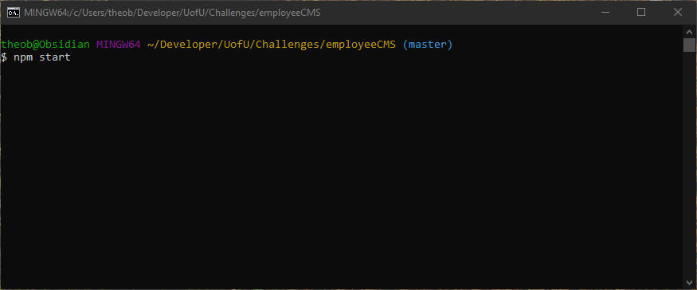
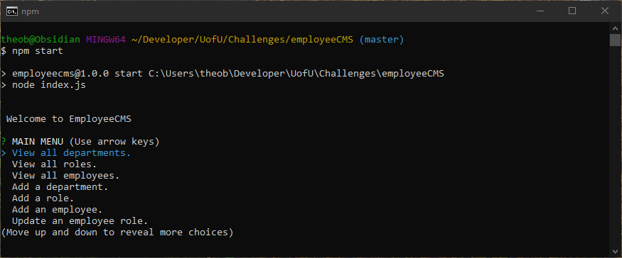
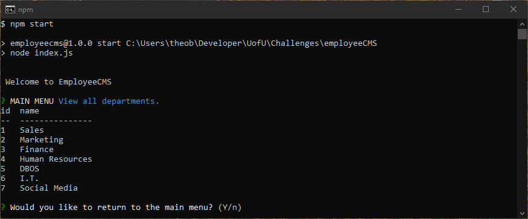
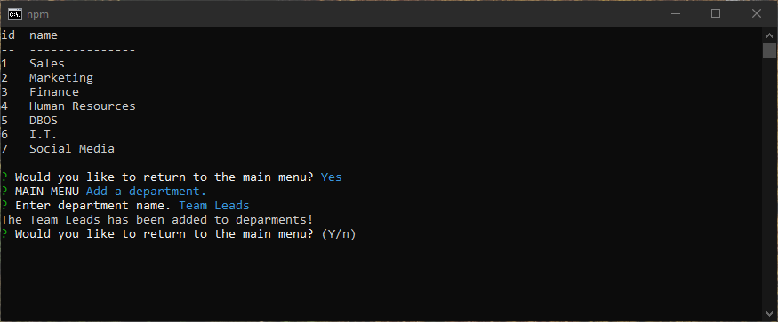
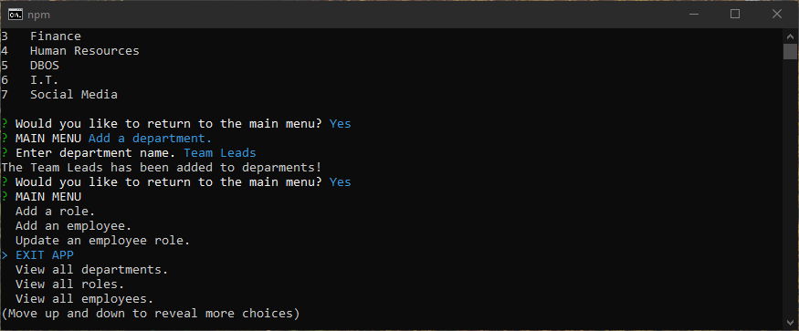

# employeeCMS 

## Description:
Employee CSM to view and manage the departments, roles, and employees in a company

## Table of Contents:
* [Installation](#installation)
* [Usage](#usage)
* [License](#license)

## Installation
* Run npm install to install all dependencies
* Enter the db folder and open MYSQL in thte command line and run "source schema.sql" and "source seeds.sql."

## Usage:
[Video Demo](https://youtu.be/aNLXtamWZNw)

Run "npm start" in the root directory to start the application.
Select from the menu to view, add, or update an employee.

Depending on the user selection view data or answer prompt questions and then select yes or no if you want to go back to the main menu.

When the user is dont with using the application, select "EXIT APP" in the main menu.

## License:
This project is covered under the following license(s): MIT
